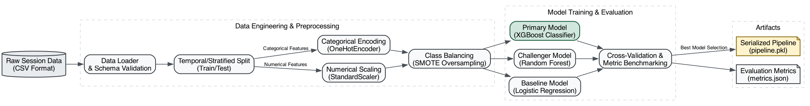

# Purchase Intent Prediction

## Project Overview
This repository contains a machine learning engineering project designed to predict e-commerce purchase intent from session clickstream data. Built as an end-to-end data science portfolio piece, the system ingests raw user session metrics, applies robust preprocessing to handle severe class imbalances, and trains an ensemble classifier to predict whether a browsing session will result in a transaction. The final model is serialized and deployed through an interactive Streamlit dashboard, providing real-time inference and actionable insights.

## Key Features
* **Real-time inference**: A deployed prediction engine capable of scoring session payloads instantly.
* **Purchase probability estimation**: Beyond binary classification, the model outputs confidence scores to bucket users into intent tiers.
* **SHAP explainability**: Visual and quantitative interpretation of feature importance to ensure model decisions align with business logic.
* **Interactive dashboard**: A user-friendly Streamlit web application providing executive metrics, model comparisons, and real-time predictions.

## Business Problem
E-commerce websites typically experience high cart abandonment rates, often exceeding 70%. Blanketing all non-converting users with retargeting ads or discounts is expensive and inefficient. By accurately predicting purchase intent during an active session, marketing teams can segment users. High-intent users can be left alone to convert naturally, while medium or low-intent users can be strategically targeted with incentives (like discounts) to prevent abandonment, optimizing the marketing budget.

## Dataset Description
The model is trained on the `online_shoppers_intention.csv` dataset, which contains 12,330 e-commerce sessions. Each session is defined by 17 feature columns, including:
- **Numerical Features**: Page visit counts (Administrative, Informational, ProductRelated), corresponding durations, BounceRates, ExitRates, and PageValues.
- **Categorical Features**: Month, OperatingSystems, Browser, Region, TrafficType, VisitorType, and Weekend.
- **Target Variable**: `Revenue` (Boolean indicating whether the session ended in a transaction).

## Machine Learning Pipeline
The data engineering pipeline is constructed using `scikit-learn`'s `ColumnTransformer` and `imblearn`'s `Pipeline` to ensure no data leakage occurs during cross-validation.
1. **Numerical Scaling**: Continuous variables like duration metrics are normalized using `StandardScaler` to prevent features with large absolute values from dominating the gradient.
2. **Categorical Encoding**: Nominal variables (e.g., Browser, VisitorType) are transformed using `OneHotEncoder` to create sparse boolean matrices without implying arbitrary ordinal relationships.
3. **Class Balancing**: Because conversions represent a small minority of all sessions, Synthetic Minority Over-sampling Technique (`SMOTE`) is applied exclusively to the training set. This synthesizes minority class examples, shifting the decision boundary to improve recall without polluting the test set.

## Model Training Process
Three classification algorithms were benchmarked to find the optimal balance between precision, recall, and inference latency:
1. **Logistic Regression**: Used as a linear baseline.
2. **Random Forest**: An ensemble method using bagging to reduce variance and capture non-linear feature interactions.
3. **XGBoost**: A gradient boosting framework designed to iteratively minimize residual errors.

Models were evaluated using a stratified 80/20 train-test split (9,864 training samples, 2,466 test samples).

## Performance Metrics
The **Random Forest** classifier was selected as the production model, achieving the highest weighted F1 score and ROC-AUC. 

**Production Model Performance (Random Forest):**
* **Accuracy (89.4%)**: The overall percentage of sessions (both purchases and abandonments) the model predicted correctly.
* **Weighted F1 Score (89.4%)**: A balanced metric that combines Precision and Recall, weighted by the number of true instances for each class. This is the primary metric used for selection due to the dataset's class imbalance.
* **ROC-AUC (92.4%)**: Represents the model's ability to distinguish between the two classes. A score of 92.4% indicates excellent separability between buyers and non-buyers.
* **Precision (68.8%)**: Out of all the sessions the model flagged as "likely to purchase," 68.8% actually resulted in a purchase. This is crucial for ensuring marketing budgets aren't wasted on false positives.

## Model Explainability (SHAP)
To ensure the model isn't functioning as a "black box," SHapley Additive exPlanations (SHAP) was used to audit the Random Forest's decision logic. 
The analysis confirmed that the model heavily relies on `PageValues` (the historical transaction value of the pages visited) as the strongest positive predictor of conversion, while high `ExitRates` act as the strongest negative predictor. This confirms the model learned sound e-commerce funnel mechanics rather than arbitrary noise.

## Streamlit Application Features
The `app.py` script launches a local web dashboard featuring three primary tabs:
1. **Inference Engine**: Allows users to manually input session parameters via sliders and dropdowns to instantly receive a conversion probability and a recommended marketing action.
2. **Analytics Dashboard**: Displays production model performance KPIs, dataset statistics, and a benchmark comparison table.
3. **Architecture & Data**: Visualizes the system architecture, the machine learning pipeline, and the SHAP feature importance summary.

## Project Structure
```text
purchase-intent-prediction/
├── models/
│   └── pipeline.pkl                  # Serialized Random Forest model & preprocessor
├── reports/
│   ├── figures/
│   │   ├── benchmark_comparison.png  # Bar chart of model F1 scores
│   │   ├── cm_logistic_regression.png
│   │   ├── cm_random_forest.png      # Confusion matrix for the best model
│   │   ├── cm_xgboost.png
│   │   └── shap_summary.png          # SHAP feature importance plot
│   ├── benchmark_results.csv         # Raw metric output for all models
│   ├── explainability_report.md      # Detailed breakdown of SHAP findings
│   ├── feature_engineering_report.md # Rationale behind the preprocessing steps
│   ├── metrics.json                  # JSON payload used by the Streamlit app
│   ├── model_comparison.md           # Benchmarking methodology
│   ├── architecture_diagram.png      # System topology
│   └── pipeline_diagram.png          # Data flow diagram
├── src/
│   ├── models/
│   │   └── diagrams.py               # Script generating Graphviz diagrams
│   ├── __init__.py
│   ├── data_processor.py             # Data loading and ColumnTransformer config
│   ├── interpret.py                  # Script executing SHAP analysis
│   └── train.py                      # Main training and benchmarking script
├── .gitignore
├── app.py                            # Streamlit dashboard application
├── online_shoppers_intention.csv     # Raw dataset
└── requirements.txt                  # Python dependencies
```

## Installation
Ensure you have Python 3.9+ installed. It is highly recommended to use a virtual environment.

```bash
# Clone the repository
git clone https://github.com/its-dhruv-here/purchase-intent-prediction.git
cd purchase-intent-prediction

# Create and activate a virtual environment
python -m venv .venv
source .venv/bin/activate  # On Windows use: .venv\Scripts\activate

# Install the required dependencies
pip install -r requirements.txt
```
*(Note: To regenerate the architecture diagrams, the system requires `graphviz` to be installed via `brew install graphviz` on macOS or `apt-get install graphviz` on Linux).*

## How to Run

**1. Train the Models and Generate Metrics**
This script will load the data, apply SMOTE, train all three models, evaluate them, and save the best pipeline to the `models/` directory.
```bash
python src/train.py
```

**2. Generate SHAP Explainability Plots**
```bash
python src/interpret.py
```

**3. Launch the Interactive Dashboard**
```bash
streamlit run app.py
```

## Results
The finalized machine learning pipeline successfully identifies high-intent browsing sessions with an 89.4% Weighted F1 Score and a 92.4% ROC-AUC. By deploying this model via the interactive Streamlit application, marketing teams can programmatically segment site traffic, reducing wasted ad spend by specifically targeting "fence-sitting" users rather than users who are either guaranteed to buy or guaranteed to abandon.

## Screenshots

### Machine Learning Pipeline


### Model Explainability


### System Architecture


## Future Improvements
- **Hyperparameter Tuning**: Implement `GridSearchCV` or `Optuna` to fine-tune the Random Forest parameters (e.g., max depth, min samples split) to squeeze out further precision.
- **REST API Integration**: Extract the inference logic from Streamlit into a dedicated FastAPI microservice to allow real external applications to query the model.
- **Additional Feature Engineering**: Extract time-of-day or day-of-week variables from raw timestamps (if available in future datasets) to capture diurnal shopping patterns.
