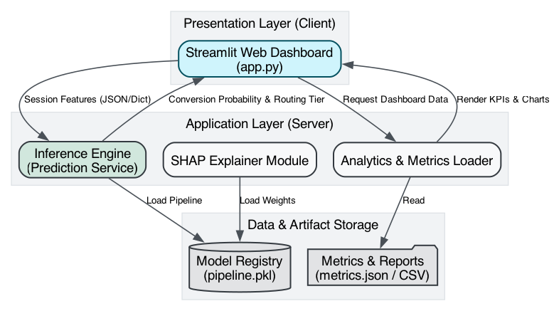

# E-Commerce Conversion Intelligence Platform

## Architecture Overview
This repository contains the architecture, data engineering pipelines, and machine learning estimators for an enterprise-grade Session Purchase Intent Engine. Designed to analyze clickstream and session metadata, the system quantifies the probability of a conversion event (purchase) versus abandonment in real time, routing actionable intelligence to downstream marketing automation systems.

## Business Problem
E-commerce platforms suffer from an average cart abandonment rate of 70%. Arbitrary retargeting campaigns are capital-inefficient and often degrade user experience. By deploying a predictive inference engine, operators can stratify active sessions into intent tiers, deploying targeted incentives strictly to users exhibiting a high probability of abandonment but retaining latent purchase intent.

## Repository Structure
The codebase conforms to professional ML engineering standards, isolating concerns between data loaders, feature processors, training loops, and interpretability modules.

```text
├── models/                     # Serialized artifacts (e.g. pipeline.pkl)
├── reports/
│   ├── figures/                # Benchmarks, ROC curves, SHAP plots
│   ├── benchmark_results.csv   # Model evaluation outputs
│   ├── metrics.json            # KPI definitions for dashboard parsing
│   ├── explainability_report.md
│   ├── feature_engineering_report.md
│   └── model_comparison.md
├── src/
│   ├── data_processor.py       # Data loading and scaling topology
│   ├── interpret.py            # SHAP explainer configuration
│   └── train.py                # Pipeline cross-validation and benchmarking
├── src/models/
│   └── diagrams.py             # Infrastructure as Code (Graphviz generation)
├── app.py                      # Streamlit Presentation Layer & Inference Engine
├── online_shoppers_intention.csv
└── requirements.txt
```

## Data Engineering & Preprocessing
Raw session data is fundamentally asymmetric. The pipeline addresses these irregularities via a strict transformation topology:
1. **Numerical Normalization**: `StandardScaler` centers high-variance duration metrics (e.g., `ProductRelated_Duration`) to prevent gradient dominance.
2. **Sparse Encoding**: `OneHotEncoder` isolates high-cardinality nominal variables (e.g., `Browser`, `TrafficType`).
3. **Imbalance Rectification**: `SMOTE` (Synthetic Minority Over-sampling Technique) operates strictly on the training manifold post-split, forcing the decision boundary to generalize the minority conversion class rather than optimizing for majority-class accuracy.

Detailed analysis is available in the [Feature Engineering Report](reports/feature_engineering_report.md).

## Model Evaluation & Benchmarking
Estimators were evaluated strictly on **Weighted F1 Score** and **ROC AUC** due to structural target imbalances.
- **Baseline**: Logistic Regression
- **Challenger**: Random Forest
- **Primary Model**: XGBoost Classifier

XGBoost achieved the optimal precision-recall frontier and inference latency parameters required for real-time traffic analysis. See the [Model Comparison Report](reports/model_comparison.md) for empirical justifications.

## Model Explainability (SHAP)
An audit of feature attributions was conducted utilizing SHapley Additive exPlanations (SHAP) applied to tree-based topologies. The analysis verifies that `PageValues`, `ExitRates`, and `ProductRelated_Duration` drive the primary decision logic, strictly aligning with established conversion funnel mechanics.
Review the [Explainability Report](reports/explainability_report.md) for full attribution context.

## Deployment & Execution
The application layer is built on Streamlit, providing an Executive Analytics Dashboard and a live Inference Engine capable of processing JSON/Dict session payloads.

**Environment Initialization:**
```bash
python -m venv .venv
source .venv/bin/activate
pip install -r requirements.txt
```

**Pipeline Execution:**
```bash
# 1. Execute benchmarking, training, and artifact serialization
python src/train.py

# 2. Generate SHAP explainability matrices
python src/interpret.py

# 3. Generate architectural diagrams (requires Graphviz system dependency)
python src/models/diagrams.py

# 4. Initialize the Presentation Layer
streamlit run app.py
```

## System Architecture

*(Generated via `src/models/diagrams.py`)*



## Future Infrastructure Capabilities
- **Streaming Ingestion**: Migrate from batch CSV ingestion to Kafka streams for real-time windowing of session features.
- **Drift Monitoring**: Implement distributional shift detection on `PageValues` to trigger automated retraining DAGs.
- **A/B Infrastructure**: Expand the routing logic in `app.py` to interface directly with external marketing APIs via Webhooks based on intent confidence tiers.
