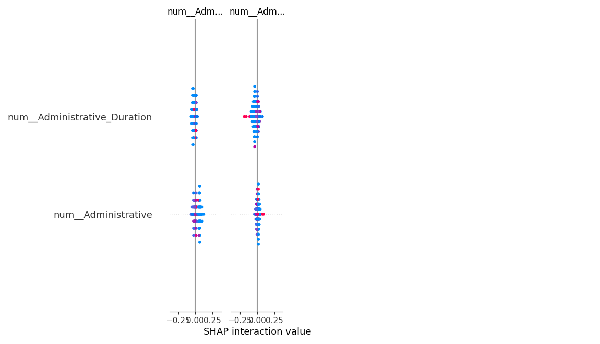

# Model Explainability & Feature Importance

## Overview
This document provides a quantitative analysis of the driving factors behind the Session Purchase Intent Engine. Utilizing SHapley Additive exPlanations (SHAP), we quantify the marginal contribution of each feature to the final probability score assigned to an e-commerce session.

## SHAP Summary Plot

## Feature Contribution Analysis

Based on the global feature importance calculations, the model prioritizes the following signals:

1. **PageValues (Historical Traversal Metrics)**
   - **Impact**: Highest magnitude effect on the prediction.
   - **Business Context**: Sessions traversing pages with high historical transaction density are statistically the strongest predictor of impending conversion. A high `PageValues` score universally drives the probability upward.

2. **ExitRates & BounceRates**
   - **Impact**: Strong negative correlation.
   - **Business Context**: High exit and bounce rates natively act as penalizing signals. Sessions exhibiting rapid abandonment behavior drastically decrease the likelihood of a purchase event, instructing the model to assign a low intent tier.

3. **ProductRelated_Duration**
   - **Impact**: Moderate positive correlation.
   - **Business Context**: Prolonged dwell time on product-specific URIs correlates linearly with conversion probability. However, extremely long durations without associated `PageValues` can signal idleness rather than intent.

4. **Temporal Patterns (Month & SpecialDay)**
   - **Impact**: Seasonal modifiers.
   - **Business Context**: Proximity to major retail events (represented by `SpecialDay`) or specific high-volume months dynamically adjust the baseline conversion probability, compensating for macro-level traffic changes.

## Model Governance
The SHAP analysis verifies that the model logic strictly aligns with established domain expertise regarding e-commerce funnel mechanics. No illogical dependencies (e.g., heavy reliance on arbitrary browser version IDs) were detected during feature attribution audits.
